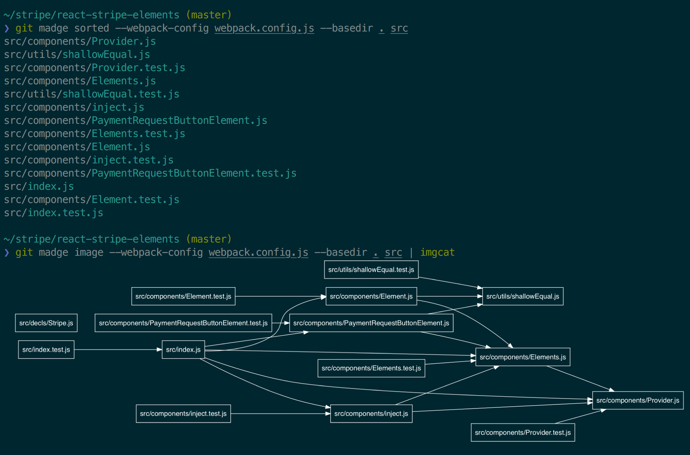
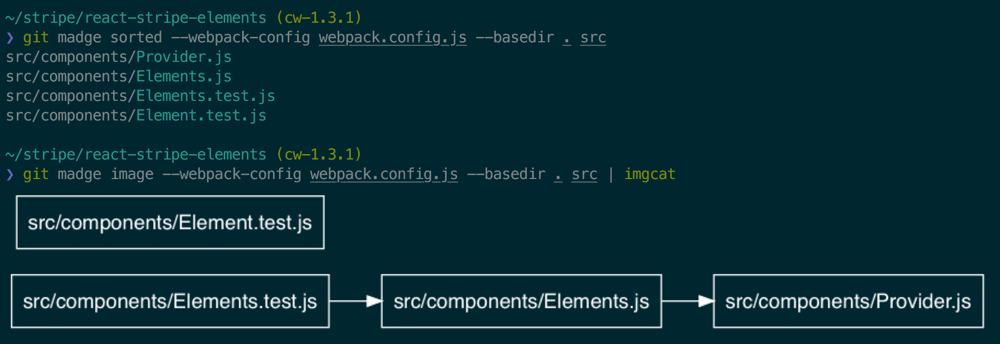

# git-madge

> Git-aware madge wrapper

[Madge] is tool for slicing and dicing the dependencies of your JavaScript
project. `git-madge` is a wrapper for [Madge] that makes it git-aware. This
means that it understands what branch you're on, and only runs on those files
that have changed by this branch.

[Madge]: https://github.com/pahen/madge

`git-madge` can do two main things right now:

- list files in order of their dependencies
- draw a graph of dependencies



If you're on a branch, the output gets limited to only those files that changed
in this branch:



(Note: we're rendering images in the terminal with iTerm2's `imgcat` program.)

## Install

### Dependencies

Requires that `madge` and `jq` are on your path:

```
npm install -g madge
brew install jq
```

If you want to use any of the visual features, you'll also need `graphviz`:

```
brew install graphviz
```

If you're using iTerm2 and you want to display images in the terminal, install
`imgcat`:

<https://iterm2.com/documentation-images.html>

### Installation

Copy the `git-madge` file to your path. Alternatively, using Homebrew:

```
brew install jez/formulae/git-madge
```


## Usage

```
❯ git madge -h
Git-aware madge.

Usage:
  git madge sorted [options] <madge option>...
  git madge dot    [options] <madge option>...  >  <filename>.dot
  git madge image  [options] <madge option>...  >  <filename>.png

Options:
  -b <branch>, --base <branch>  Limit madge to files changed by <branch>. If on
                                <branch>, operate on all files in the repo.
                                [default: master]
  -s <style>, --style <style>   Use <style> when generating a graphviz image.
                                Can be a preset or a path to a graphviz program
                                that styles the graph. Available presets:
                                black solarized-dark solarized-light white
                                [default: white]
  --dpi <dpi>                   Set the DPI of graphviz output to <dpi>.
  -h

Madge Options:
  Madge requires at least a path in which to find JavaScript files.
  You may also wish to configure things like webpack loaders.

  Usage: madge [options] <src...>

  Options:

    (... elided ...)
```

## Examples

`git-madge` always works with respect to the current git branch that you're on.

- If you're on master, it'll work with respect to the entire repo.
- On a non-master branch, the commands apply to **only the files changed by that
  branch**.

To list the entire repo's files sorted by dependency order:

```
~/demo (master)
❯ git madge sorted .
src/components/Provider.js
src/utils/shallowEqual.js
src/components/Elements.js
src/components/inject.js
src/components/PaymentRequestButtonElement.js
src/components/Element.js
src/index.js
```

Change to a branch, and the list gets shorter:

```
~/demo (my-branch)
❯ git madge sorted .
src/components/PaymentRequestButtonElement.js
src/components/Element.js
src/index.js
```

If you want to filter with respect to a revision other than `master`, use
`--base`:

``` bash
# only files changed by last commit:
❯ git madge sorted --base HEAD^ .
```

You can pass [any arguments that `madge` supports][flags], like webpack config,
or paths:

```bash
# Custom webpack config
❯ git madge sorted --webpack-config webpack.config.js

# Limit to src/components/ folder
❯ git madge sorted src/components/
```

[flags]: https://github.com/pahen/madge#cli

Like `madge`, with `git-madge` you can create an image from the dependencies.
And if you're on a non-master branch, the image shows nodes for only files
changed by this branch.

```bash
❯ git madge image . > graph.png
```

Another fun thing you can do (if you happen to use iTerm2) is show these images
directly in your terminal with [imgcat]:

```bash
# FIRST: Download imgcat: https://iterm2.com/documentation-images.html

❯ git madge image . | imgcat
```

[imgcat]: https://iterm2.com/documentation-images.html

## Tips

Use aliases to make the command invocation more convenient. Git lets you make
per-project aliases, so you can stash the config options required by any given
project:

```bash
git config alias.sorted  'madge sorted --basedir . --webpack-config webpack.config.js src'

# another variant that excludes tests
git config alias.sortedt 'madge sorted --basedir . --webpack-config webpack.config.js --exclude ".*\.test\.js" src'

# show the dependency image
git config alias.depgraph 'madge image --basedir . --webpack-config webpack.config.js --exclude ".*\.test\.js" src'
```

Then you can just do this:

```
git checkout my-branch
git sorted
git depgraph | imgcat
```

## Styles

Available stylesheets are in the [styles/](styles/) directory.

Feel free to copy one, modify it, and contribute it back! Pull requests are very
welcome.

## License

[](https://jez.io/MIT-LICENSE.txt)
