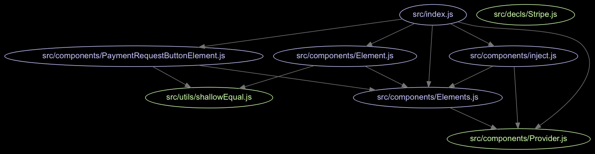
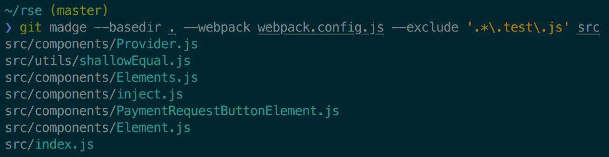

# git-madge

> Git-aware madge wrapper

[Madge] is tool for slicing and dicing the dependencies of your JavaScript
project. `git-madge` is a simple wrapper for [Madge] that makes it git-aware. It
looks at files that have changed since `master` (or all files if on `master`),
and prints them, sorted by their dependencies.

[Madge]: https://github.com/pahen/madge

For example, if a repo's dependency graph looks like this:



then `git-madge` will generate this listing:



You can use this list when code reviewing a branch (to order the files you look
at).

## Install

### Dependencies

Requires that `madge` and `jq` are on your path:

```
npm install -g madge
brew install jq
```

### Installation

Copy the `git-madge` file to your path. Alternatively, on Homebrew:

```
brew install jez/formulae/git-madge
```


## Usage

If you're on master, it lists all JavaScript files, sorted by their
dependencies.

```
~/demo (master)
❯ git madge .
components/Element.js
components/Element.test.js
components/Elements.js
components/PaymentRequestButtonElement.js
components/PaymentRequestButtonElement.test.js
components/Provider.js
components/Provider.test.js
components/inject.js
components/inject.test.js
decls/Stripe.js
index.js
index.test.js
utils/shallowEqual.js
utils/shallowEqual.test.js
```

If you're on a branch, it'll filter the list to only files that have changed
since master. This is especially useful for code review; reviewing the files in
sorted order makes it so that you read the leaves first, then move up the tree.

```
~/demo (my-branch)
❯ git madge .
components/Element.js
components/Element.test.js
components/Elements.js
components/PaymentRequestButtonElement.js
components/PaymentRequestButtonElement.test.js
```

If you want to filter with respect to a different revision, set `REVIEW_BASE`:

``` bash
# only files changed by last commit:
❯ REVIEW_BASE=HEAD^ git madge .
```

You can pass [any arguments that `madge` supports][flags], like webpack config,
or paths:

```bash
# Custom webpack config
❯ git madge --webpack-config webpack.config.js

# Limit to src/components/ folder
❯ git madge src/components/
```

[flags]: https://github.com/pahen/madge#cli


## TODO

- [ ] Support generating images filtering by list of changed files (instead of
  only printing them).


## License

[](https://jez.io/MIT-LICENSE.txt)
